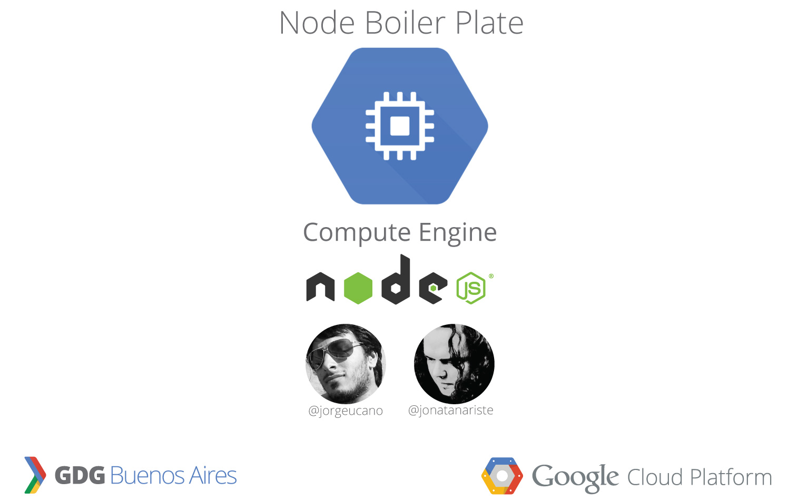

# 

## GDG Node Boiler Plate for Google Cloud Platform

How to install #GDGNodeBoilerPlate in Google Compute Engine (Ubuntu)

1 - Create a new instance VM (Ubuntu 14.04 Trusty)

2 - Fork the proyect

3 - change the private IP, by the IP private of your Cloud 

4 - Open SSH console

5 - wget https://github.com/YOURNICKNAME/GDGNodeBoilerPlate/raw/master/install.sh  (change YOURNICKNAME for the nick name of github )

6 - run: source install.sh

7 - Be happy. 

## Command Code:

  Stop node instance : source stop.sh

  start node instance : source start.sh

  update git instance : source update.sh  """Do no need to turn off (stop) the instance"""

## Inspiration

GDG Node Boiler Plate is inspired by [Mobile HTML5 Boilerplate](http://html5boilerplate.com/mobile/) and Yeoman's [generator-gulp-webapp](https://github.com/yeoman/generator-gulp-webapp), having taken input from contributors to both projects during development. Our [FAQs](https://github.com/google/web-starter-kit/wiki/FAQ) attempt to answer commonly asked questions about the project.

## Created by:

Jorge Cano Manager GDG Buenos Aires @jorgeucano

Jonatan Ariste Manager GDG Buenos Aires @jonatanariste

----------------------------------------------------------------------------------------------

Cómo instalar #GDGNodeBoilerPlate en Google Compute Engine (Ubuntu)

1 - Crear una nueva máquina virtual (Ubuntu 14.04 de trusty)

2 - forkear el proyecto

3 - Dentro del archivo start.sh, debe cambiar la IP privada, por la privada IP de su maquina virtual (dentro de su de google console.developers.google.com encontrara los parametros de su maquina virtual, ahi encontrara su ip privada)

3.1 - Modificar el archivo install.sh, el usuario de git, en la linea 4 debe cambiar PUTYOURUSERGITHERE, por su apado de github.

4 - Abra la consola ssh de google

5 - ejecute el siguiente comando ->  wget https://github.com/YOURNICKNAME/GDGNodeBoilerPlate/raw/master/install.sh (cambiar YOURNICKNAME para el apodo de github)

6 - ejecute el siguiente comando -> source install.sh

7 - Sé feliz.

## Comandos para la consola:

  Detener la instancia de nodejs : source stop.sh

  Arrancar la instancia de nodejs : source start.sh

  Hacer un update de su subversionado : source update.sh  """No necesita hacer stop sobre la instancia"""

## Inspiración

GDG Node Boiler Plate is inspired by [Mobile HTML5 Boilerplate](http://html5boilerplate.com/mobile/) and Yeoman's [generator-gulp-webapp](https://github.com/yeoman/generator-gulp-webapp), having taken input from contributors to both projects during development. Our [FAQs](https://github.com/google/web-starter-kit/wiki/FAQ) attempt to answer commonly asked questions about the project.

## Creado por:

Jorge Cano Manager GDG Buenos Aires @jorgeucano

Jonatan Ariste Manager GDG Buenos Aires @jonatanariste
